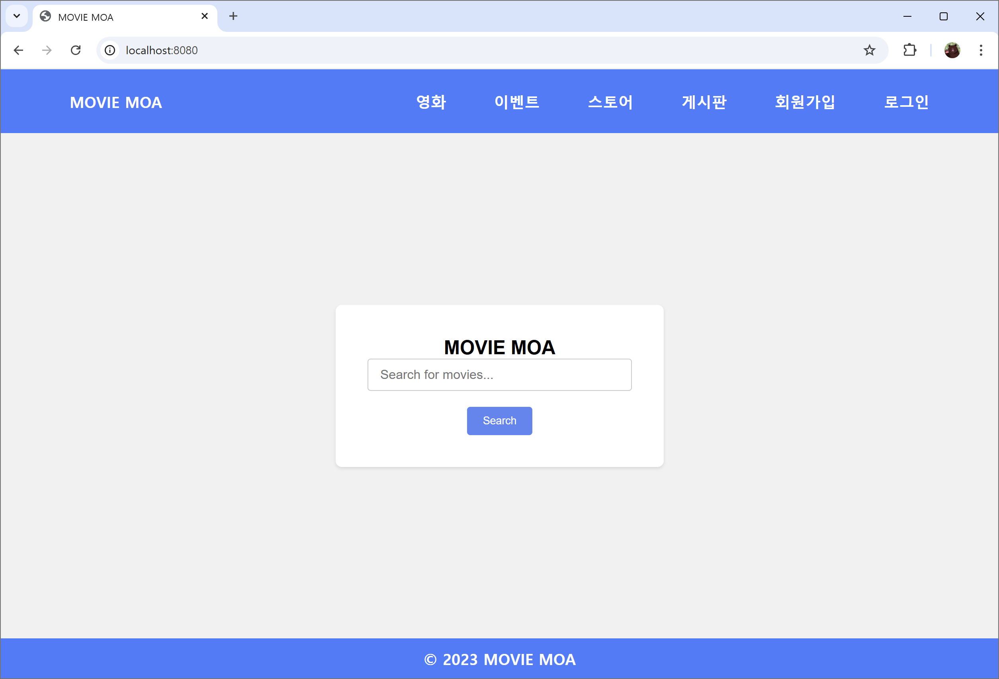
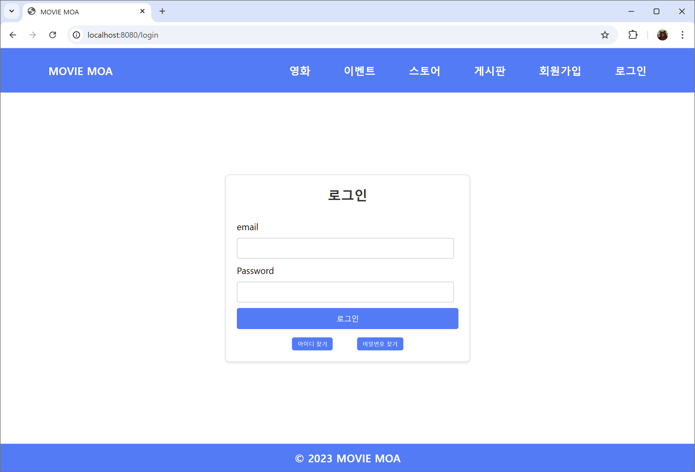
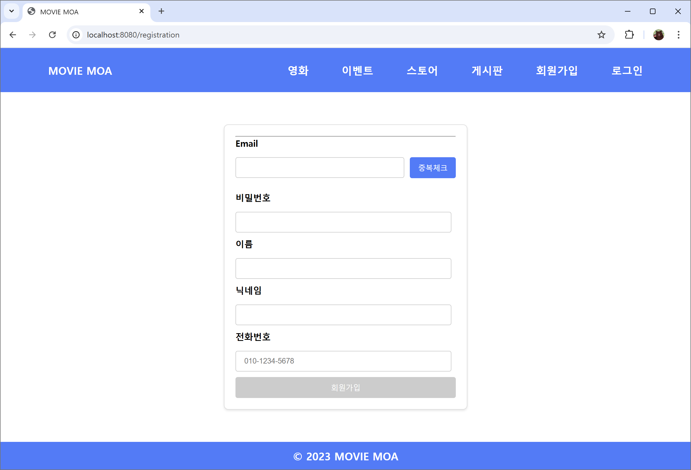
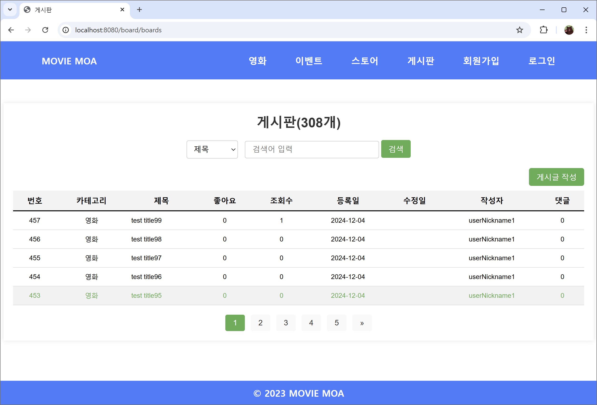
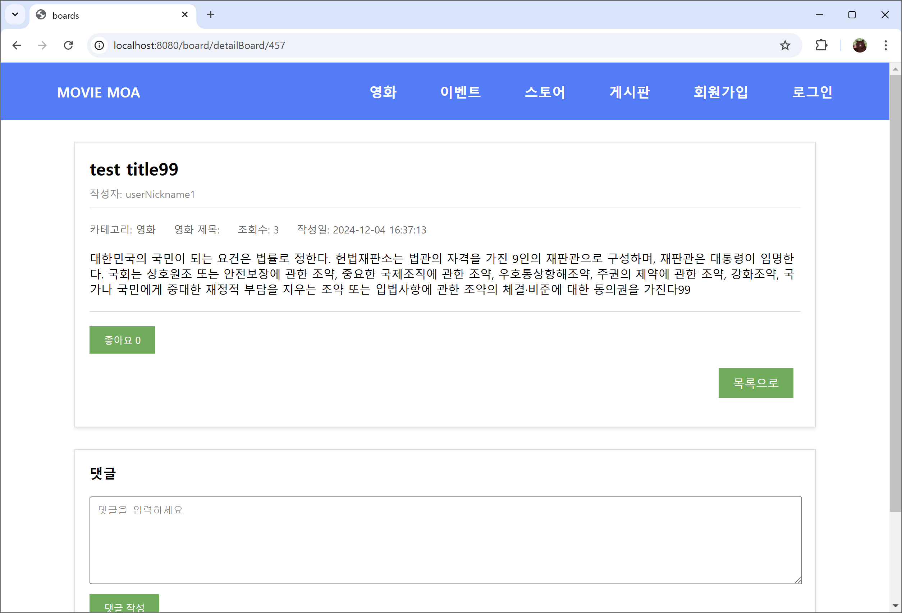

# 🎥 MovieMoa

MovieMoa는 사용자가 **영화 정보를 확인**하고, 영화에 대한 **감상평**과 **댓글**을 통해 소통할 수 있는 영화 커뮤니티 웹사이트입니다.  
이 프로젝트는 **Spring Boot**와 **MyBatis**를 활용하여 개발된 학습 및 협업 프로젝트입니다.

---

## 📅 프로젝트 개요

- **개발 기간**: 2023.10 ~ 2023.11  
- **팀원 구성**: 5명

---

## ✨ 주요 기능

1. **영화 정보 제공**:
   - 영화 API를 통해 현재 상영 중인 영화 및 인기 영화 정보를 제공합니다.
   - 검색 기능을 통해 원하는 영화를 찾을 수 있습니다.
2. **게시판 기능**:
   - 사용자가 영화에 대한 감상평을 작성하고 게시할 수 있습니다.
   - 댓글 기능을 통해 다른 사용자와 소통할 수 있습니다.
3. **회원 관리**:
   - 회원가입, 로그인, 로그아웃 기능 제공.
   - 비밀번호 암호화 및 인증/권한 관리는 **Spring Security**를 통해 구현되었습니다.
4. **관리자 페이지**:
   - 부적절한 게시글 및 댓글 관리 기능 제공.
   - 통계 데이터를 통해 사이트 관리 효율성 향상.

---

## 🛠️ 개발 환경 및 기술 스택

- **Backend**:
  - Spring Boot 3.1.4
  - H2 Database (기본)
  - Oracle DB (ojdbc 8 지원)
  - MyBatis
  - Lombok
  - **Spring Security**
  - Gradle
- **Frontend**:
  - Thymeleaf
  - HTML5 / CSS3
  - JavaScript / JQuery / Ajax
- **Testing**:
  - JUnit 5
- **로깅**:
  - log4jdbc-log4j2

---

## 📂 주요 페이지 및 기능

### 🎬 영화 정보 페이지
- 영화 제목, 포스터, 줄거리, 평점 등 상세 정보를 제공합니다.
- API를 연동하여 실시간 영화 데이터를 표시합니다.
- 검색 기능 제공.

### 📝 게시판
- 사용자가 영화에 대한 감상평을 작성하고 공유할 수 있습니다.
- 작성된 게시글에 댓글을 달아 의견을 나눌 수 있습니다.

### 🔒 회원 관리
- 회원가입 및 로그인/로그아웃 기능 제공.
- **Spring Security**를 활용하여 비밀번호 암호화 및 인증 구현.

### 🛠️ 관리자 페이지
- 게시글 및 댓글을 모니터링하고 부적절한 내용을 삭제할 수 있습니다.
- 유저 관리 및 데이터 통계를 확인할 수 있습니다.

---

## 🚀 실행 방법

### 1. 필수 소프트웨어 설치
- **Java JDK 17 이상**: [다운로드 링크](https://www.oracle.com/java/technologies/javase-downloads.html)
- **Gradle**: Gradle Wrapper가 포함되어 있으므로 별도 설치는 필요하지 않습니다.

### 2. 프로젝트 다운로드 및 디렉토리 이동
```bash
# 프로젝트 압축 해제 후 디렉토리로 이동
cd moviemoa
```

### 3. 빌드 및 실행
1. **프로젝트 빌드**:
   ```bash
   ./gradlew build
   ```
2. **애플리케이션 실행**:
   ```bash
   ./gradlew bootRun
   ```

3. **애플리케이션 확인**:
   - 브라우저에서 `http://localhost:8080` 접속.

---

## 🛢️ 데이터베이스 설정

### H2 데이터베이스 (기본 설정)
H2 데이터베이스가 기본으로 설정되어 있으며, 실행 후 `http://localhost:8080/h2-console`에서 접속할 수 있습니다.

- **JDBC URL**: `jdbc:h2:mem:testdb`
- **User**: `sa`
- **Password**: 없음

### Oracle DB 설정 (선택 사항)
Oracle DB를 사용하려면 `src/main/resources/application.properties` 파일을 수정합니다:

```properties
# Oracle DB 설정 예시
spring.datasource.url=jdbc:oracle:thin:@localhost:1521:xe
spring.datasource.username=your_username
spring.datasource.password=your_password
spring.datasource.driver-class-name=oracle.jdbc.OracleDriver
```

`build.gradle`에 Oracle JDBC 드라이버를 추가하세요:
```gradle
dependencies {
    implementation 'com.oracle.database.jdbc:ojdbc8:19.3.0.0'
}
```

---


## 📸 프로젝트 화면 예시

> ### 메인 페이지


### 로그인 페이지


### 회원가입 페이지


### 메인 페이지


### 로그인 페이지


### 회원가입 페이지


### 게시판


### 게시글 보기


---


## 🏆 프로젝트 성과 및 배운 점

- **Spring Boot**를 활용한 백엔드 개발 경험.
- **MyBatis**를 활용하여 데이터베이스와의 연동을 효율적으로 구현.
- **Spring Security**를 통해 인증 및 권한 관리를 구현하여 안전한 웹 애플리케이션 개발.
- **팀 협업** 및 **문제 해결 능력** 향상.

---

## 📜 라이센스
이 프로젝트는 학습 목적으로 제작되었으며, 공개된 코드는 자유롭게 참고할 수 있습니다. 단, 상업적 사용은 금지됩니다.
